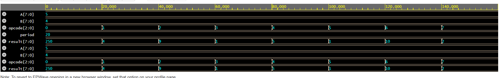
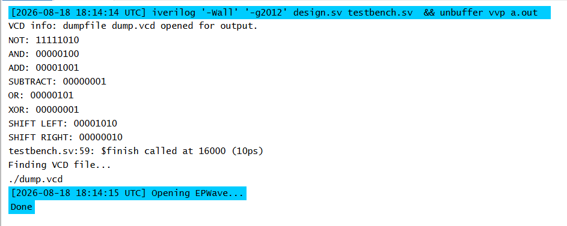

# 8-Bit-ALU

## Overview
This project implements an 8-bit combinational Arithmetic Logic Unit (ALU) in SystemVerilog. The ALU performs arithmetic, logical, and shift operations selected through a 3-bit opcode. A dedicated testbench was created to verify all supported operations through simulation.

---

## Features
- 8-Bit Datapath
- Combinational RTL ('always_comb')
- 3-Bit opcode control
- Eight ALU operations
- Simulation Testbench

---

## Supported Operations
 - 000 -> NOT A
 - 001 -> AND
 - 010 -> ADD
 - 011 -> SUBTRACT
 - 100 -> OR
 - 101 -> XOR
 - 110 -> SHIFT LEFT (A)
 - 111 -> SHIFT RIGHT (A)

---

## Program Structure

src/
- ALU.sv

tb/ 
- ALU_tb.sv

---

## Example Simulation 

Example:

A: 5

B: 4

ADD: 9 

SUBTRACT: 1 

SHIFT LEFT: 10

---

## Simulation Waveform

The waveform below shows the ALU being tested across its supported
operations using different 3-bit opcode values.

---

## Test Bench Results

The testbench verifies the expected output for each ALU operation.

## Improvements
- Zero flag
- Carry flag
- Overflow detection
- Parameterized ALU width
- FPGA implementation

